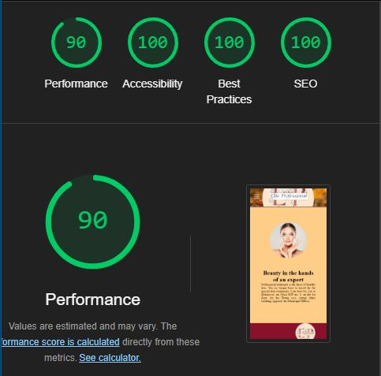

# Elite Professional Cosmetics 

[ELITE](https://hishamarashini.github.io/Project1_update/)

The Elite cosmetic describes the industry that manufactures and distributes cosmetic products. These include colour cosmetics, like foundation and mascara, skincare such as moisturisers and cleansers, haircare such as shampoos, conditioners and hair colours, and Antiaging creams. 

### Features
>Navigation
- At the top of the page, there is a image with centered Logo of Elite professional cosmetics
- The navigation links are to the right:Home, About, and contact us.
- Tha navigation is in a font that looks like the text in the website with same background hovering and red color for active
- The navigation is easy to use and clear for users.
### The Header
- The Header shows the name of company with a centered Logo
- The header describes and give hints of the products that is promoting in the page.

### The About 
[ABOUT](https://hishamarashini.github.io/Project1_update/about.html)

 - The About section gives details of the services and type of special treatrment that are done in company.

### The Contact Us
[CONTACT US](https://hishamarashini.github.io/Project1_update/contactus.html)
- The contact us section encourage users to get in contact and provide name and e-mail address.
- The contact us section has a fiels that give the users possibelity to write a message.

### The Footer
- The footer section has the address and e-mailfor users can contact the company
- The footer section includes media icon to users can find Elite proffessional cometics on Facebook, Instagram, and Youtube

### MOCK-UP
HOME
 
ABOUT 

CONTACT US 

### Testing
- I tested the pages work in different browsers, Chrome, Firefox, 

and Edge

- I confirmed the the project is responsive, looks good and functions on all standared screens sizes.
- I confirmed that the navigation, header, about, and contact us are allreadable.

### Validator Testing
- HTML 
    - No errors were returned when passing through the official W3C validator
    Home
    
    ABOUT
    
    Contact Us
    

    

- CSS
    - No errors were returned when passing through the official (Jigsaw) validator
    
- Accessibility
    - I confirmed that the colors and the fonts chosen are easy to read and accessible by running the the lighthouse in devtools.

    ### Deployment
    In the first I worked in VS studio on desktop and I commit the project as repositry in github.
    - After I commit each change, i navigate to setting and choose source section drop-down, i select main root 
    - After i click save it is automaticly indecate successful deployment 
    The live link is [Project1_update](https://hishamarashini.github.io/Project1_update/)

    ### Content
    - The icons for social media were taken from [Fontawsome](https://fontawesome.com/)

    ### Media
    - The photos and the logo is made and designed by me Hisham Alrashini

